Red Wine Data Exploration by Ali Alsuhaibani
========================================================
# Abstract
I determine how the quality of the red wine is influenced by its chemical composition. More information is located [here](https://s3.amazonaws.com/udacity-hosted-downloads/ud651/wineQualityInfo.txt)


```
## 'data.frame':	1599 obs. of  12 variables:
##  $ fixed.acidity       : num  7.4 7.8 7.8 11.2 7.4 7.4 7.9 7.3 7.8 7.5 ...
##  $ volatile.acidity    : num  0.7 0.88 0.76 0.28 0.7 0.66 0.6 0.65 0.58 0.5 ...
##  $ citric.acid         : num  0 0 0.04 0.56 0 0 0.06 0 0.02 0.36 ...
##  $ residual.sugar      : num  1.9 2.6 2.3 1.9 1.9 1.8 1.6 1.2 2 6.1 ...
##  $ chlorides           : num  0.076 0.098 0.092 0.075 0.076 0.075 0.069 0.065 0.073 0.071 ...
##  $ free.sulfur.dioxide : num  11 25 15 17 11 13 15 15 9 17 ...
##  $ total.sulfur.dioxide: num  34 67 54 60 34 40 59 21 18 102 ...
##  $ density             : num  0.998 0.997 0.997 0.998 0.998 ...
##  $ pH                  : num  3.51 3.2 3.26 3.16 3.51 3.51 3.3 3.39 3.36 3.35 ...
##  $ sulphates           : num  0.56 0.68 0.65 0.58 0.56 0.56 0.46 0.47 0.57 0.8 ...
##  $ alcohol             : num  9.4 9.8 9.8 9.8 9.4 9.4 9.4 10 9.5 10.5 ...
##  $ quality             : int  5 5 5 6 5 5 5 7 7 5 ...
```

```
##  fixed.acidity   volatile.acidity  citric.acid    residual.sugar  
##  Min.   : 4.60   Min.   :0.1200   Min.   :0.000   Min.   : 0.900  
##  1st Qu.: 7.10   1st Qu.:0.3900   1st Qu.:0.090   1st Qu.: 1.900  
##  Median : 7.90   Median :0.5200   Median :0.260   Median : 2.200  
##  Mean   : 8.32   Mean   :0.5278   Mean   :0.271   Mean   : 2.539  
##  3rd Qu.: 9.20   3rd Qu.:0.6400   3rd Qu.:0.420   3rd Qu.: 2.600  
##  Max.   :15.90   Max.   :1.5800   Max.   :1.000   Max.   :15.500  
##    chlorides       free.sulfur.dioxide total.sulfur.dioxide
##  Min.   :0.01200   Min.   : 1.00       Min.   :  6.00      
##  1st Qu.:0.07000   1st Qu.: 7.00       1st Qu.: 22.00      
##  Median :0.07900   Median :14.00       Median : 38.00      
##  Mean   :0.08747   Mean   :15.87       Mean   : 46.47      
##  3rd Qu.:0.09000   3rd Qu.:21.00       3rd Qu.: 62.00      
##  Max.   :0.61100   Max.   :72.00       Max.   :289.00      
##     density             pH          sulphates         alcohol     
##  Min.   :0.9901   Min.   :2.740   Min.   :0.3300   Min.   : 8.40  
##  1st Qu.:0.9956   1st Qu.:3.210   1st Qu.:0.5500   1st Qu.: 9.50  
##  Median :0.9968   Median :3.310   Median :0.6200   Median :10.20  
##  Mean   :0.9967   Mean   :3.311   Mean   :0.6581   Mean   :10.42  
##  3rd Qu.:0.9978   3rd Qu.:3.400   3rd Qu.:0.7300   3rd Qu.:11.10  
##  Max.   :1.0037   Max.   :4.010   Max.   :2.0000   Max.   :14.90  
##     quality     
##  Min.   :3.000  
##  1st Qu.:5.000  
##  Median :6.000  
##  Mean   :5.636  
##  3rd Qu.:6.000  
##  Max.   :8.000
```

```
## 
##   3   4   5   6   7   8 
##  10  53 681 638 199  18
```

```
##  fixed.acidity    volatile.acidity  citric.acid     residual.sugar 
##  Min.   : 4.600   Min.   :0.1200   Min.   :0.0000   Min.   :0.900  
##  1st Qu.: 7.100   1st Qu.:0.3950   1st Qu.:0.0900   1st Qu.:1.900  
##  Median : 7.900   Median :0.5200   Median :0.2500   Median :2.200  
##  Mean   : 8.259   Mean   :0.5288   Mean   :0.2661   Mean   :2.409  
##  3rd Qu.: 9.100   3rd Qu.:0.6400   3rd Qu.:0.4200   3rd Qu.:2.600  
##  Max.   :13.200   Max.   :1.5800   Max.   :1.0000   Max.   :8.300  
##    chlorides       free.sulfur.dioxide total.sulfur.dioxide
##  Min.   :0.01200   Min.   : 1.00       Min.   :  6.00      
##  1st Qu.:0.07000   1st Qu.: 7.00       1st Qu.: 21.25      
##  Median :0.07900   Median :13.00       Median : 37.00      
##  Mean   :0.08699   Mean   :15.17       Mean   : 44.52      
##  3rd Qu.:0.09000   3rd Qu.:21.00       3rd Qu.: 60.00      
##  Max.   :0.61100   Max.   :46.00       Max.   :144.00      
##     density             pH          sulphates         alcohol      quality
##  Min.   :0.9901   Min.   :2.740   Min.   :0.3300   Min.   : 8.40   3: 10  
##  1st Qu.:0.9956   1st Qu.:3.210   1st Qu.:0.5500   1st Qu.: 9.50   4: 52  
##  Median :0.9967   Median :3.310   Median :0.6200   Median :10.20   5:650  
##  Mean   :0.9967   Mean   :3.316   Mean   :0.6569   Mean   :10.43   6:614  
##  3rd Qu.:0.9978   3rd Qu.:3.400   3rd Qu.:0.7275   3rd Qu.:11.10   7:190  
##  Max.   :1.0029   Max.   :4.010   Max.   :2.0000   Max.   :14.00   8: 18
```

```
## 'data.frame':	1534 obs. of  12 variables:
##  $ fixed.acidity       : num  7.4 7.8 7.8 11.2 7.4 7.4 7.9 7.3 7.8 7.5 ...
##  $ volatile.acidity    : num  0.7 0.88 0.76 0.28 0.7 0.66 0.6 0.65 0.58 0.5 ...
##  $ citric.acid         : num  0 0 0.04 0.56 0 0 0.06 0 0.02 0.36 ...
##  $ residual.sugar      : num  1.9 2.6 2.3 1.9 1.9 1.8 1.6 1.2 2 6.1 ...
##  $ chlorides           : num  0.076 0.098 0.092 0.075 0.076 0.075 0.069 0.065 0.073 0.071 ...
##  $ free.sulfur.dioxide : num  11 25 15 17 11 13 15 15 9 17 ...
##  $ total.sulfur.dioxide: num  34 67 54 60 34 40 59 21 18 102 ...
##  $ density             : num  0.998 0.997 0.997 0.998 0.998 ...
##  $ pH                  : num  3.51 3.2 3.26 3.16 3.51 3.51 3.3 3.39 3.36 3.35 ...
##  $ sulphates           : num  0.56 0.68 0.65 0.58 0.56 0.56 0.46 0.47 0.57 0.8 ...
##  $ alcohol             : num  9.4 9.8 9.8 9.8 9.4 9.4 9.4 10 9.5 10.5 ...
##  $ quality             : Ord.factor w/ 6 levels "3"<"4"<"5"<"6"<..: 3 3 3 4 3 3 3 5 5 3 ...
```

Most of the quality ratings are either 5 or 6; with 5 being the most frequent. Quality is a categorical discrete variable, but if we were to treat it as continuous, the mean would be 5.63 and the median would be 6. The highest rating was 8, and the lowest was 3. Additionally, total sulfur dioxide and free sulfur dioxide appeared to be discrete variables. This is likely due to rounding issues. I would also think that citric acid is a subset of fixed acidity and potentially volatile acidity. 

Fixed acidity, residual sugar, total sulfur dioxide, and free sulfur dioxide were all stripped from their top 1% values as they appeared to be large outliers.


# Univariate Plots Section

To get an idea for how the data is dispersed for each variable, I created a histogram for each of them.
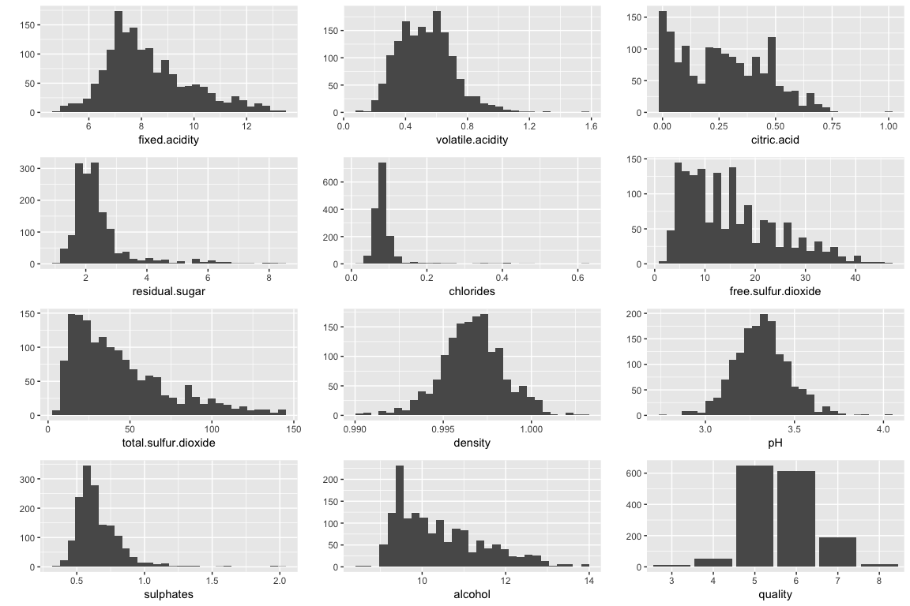<!-- -->

```
##  fixed.acidity    volatile.acidity  citric.acid     residual.sugar 
##  Min.   : 4.600   Min.   :0.1200   Min.   :0.0000   Min.   :0.900  
##  1st Qu.: 7.100   1st Qu.:0.3950   1st Qu.:0.0900   1st Qu.:1.900  
##  Median : 7.900   Median :0.5200   Median :0.2500   Median :2.200  
##  Mean   : 8.259   Mean   :0.5288   Mean   :0.2661   Mean   :2.409  
##  3rd Qu.: 9.100   3rd Qu.:0.6400   3rd Qu.:0.4200   3rd Qu.:2.600  
##  Max.   :13.200   Max.   :1.5800   Max.   :1.0000   Max.   :8.300  
##    chlorides       free.sulfur.dioxide total.sulfur.dioxide
##  Min.   :0.01200   Min.   : 1.00       Min.   :  6.00      
##  1st Qu.:0.07000   1st Qu.: 7.00       1st Qu.: 21.25      
##  Median :0.07900   Median :13.00       Median : 37.00      
##  Mean   :0.08699   Mean   :15.17       Mean   : 44.52      
##  3rd Qu.:0.09000   3rd Qu.:21.00       3rd Qu.: 60.00      
##  Max.   :0.61100   Max.   :46.00       Max.   :144.00      
##     density             pH          sulphates         alcohol      quality
##  Min.   :0.9901   Min.   :2.740   Min.   :0.3300   Min.   : 8.40   3: 10  
##  1st Qu.:0.9956   1st Qu.:3.210   1st Qu.:0.5500   1st Qu.: 9.50   4: 52  
##  Median :0.9967   Median :3.310   Median :0.6200   Median :10.20   5:650  
##  Mean   :0.9967   Mean   :3.316   Mean   :0.6569   Mean   :10.43   6:614  
##  3rd Qu.:0.9978   3rd Qu.:3.400   3rd Qu.:0.7275   3rd Qu.:11.10   7:190  
##  Max.   :1.0029   Max.   :4.010   Max.   :2.0000   Max.   :14.00   8: 18
```

Transformed the long tailed total sulfur dioxide and sulphates data for a more accurate distribution. The log10 produces a relatively normal distribution for both, and there is nothing particularly striking with the transformations, as given that there are only 1534 observations being analyzed, it's very likely that many sulphate/sulfur dioxide measurements won't be included in the data set. Variance decreases for log10 sulphates and graph looks more normal so will keep it. Total sulfur dioxide variance decreases significantly and as such appears to be nearly normal.


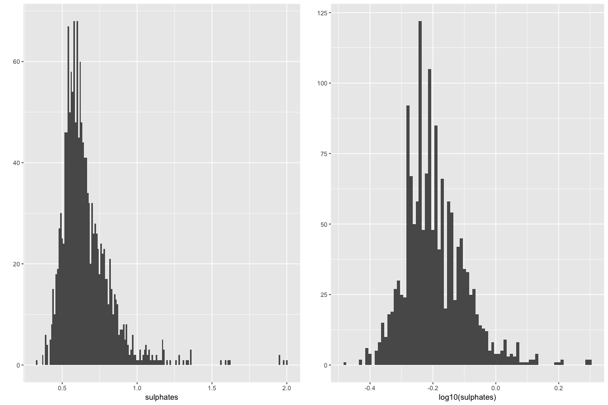<!-- -->

```
##      nbr.val     nbr.null       nbr.na          min          max 
## 1.534000e+03 0.000000e+00 0.000000e+00 3.300000e-01 2.000000e+00 
##        range          sum       median         mean      SE.mean 
## 1.670000e+00 1.007700e+03 6.200000e-01 6.569100e-01 4.339978e-03 
## CI.mean.0.95          var      std.dev     coef.var 
## 8.512921e-03 2.889351e-02 1.699809e-01 2.587583e-01
```

```
##       nbr.val      nbr.null        nbr.na           min           max 
##  1.534000e+03  1.000000e+00  0.000000e+00 -4.814861e-01  3.010300e-01 
##         range           sum        median          mean       SE.mean 
##  7.825161e-01 -2.979098e+02 -2.076083e-01 -1.942046e-01  2.476082e-03 
##  CI.mean.0.95           var       std.dev      coef.var 
##  4.856866e-03  9.404925e-03  9.697899e-02 -4.993651e-01
```

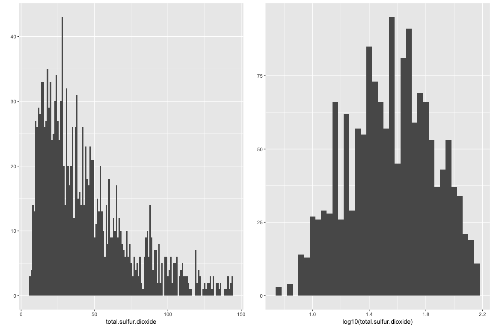<!-- -->

```
##      nbr.val     nbr.null       nbr.na          min          max 
## 1.534000e+03 0.000000e+00 0.000000e+00 6.000000e+00 1.440000e+02 
##        range          sum       median         mean      SE.mean 
## 1.380000e+02 6.829000e+04 3.700000e+01 4.451760e+01 7.624117e-01 
## CI.mean.0.95          var      std.dev     coef.var 
## 1.495480e+00 8.916706e+02 2.986085e+01 6.707651e-01
```

```
##      nbr.val     nbr.null       nbr.na          min          max 
## 1.534000e+03 0.000000e+00 0.000000e+00 7.781513e-01 2.158362e+00 
##        range          sum       median         mean      SE.mean 
## 1.380211e+00 2.379277e+03 1.568202e+00 1.551028e+00 7.633760e-03 
## CI.mean.0.95          var      std.dev     coef.var 
## 1.497372e-02 8.939277e-02 2.989862e-01 1.927665e-01
```

Fixed acidity and volatile acidity appear to be long tailed as well, and transforming their log appears to make them closer to a normal distribution. Of course, since pH is a logarithmic term, and is normal in our data set, then it would be sense for the log of acidity levels to also be approximately normal. Variances are confirmed to be a relevant decrease for fixed acidity but not entirely relevant for volatile acidity.


```
##    Min. 1st Qu.  Median    Mean 3rd Qu.    Max. 
##    6.00   21.25   37.00   44.52   60.00  144.00
```
Here in total sulfur dioxide we see the minimum was 6.00 and maxmum was 144.00 and third qurtial 60


```
##    Min. 1st Qu.  Median    Mean 3rd Qu.    Max. 
##  0.7782  1.3273  1.5682  1.5510  1.7782  2.1584
```
Here in log10 total sulfur dioxide we see the minimum was 0.778 and maxmum was 2.15 and third qurtial 1.77


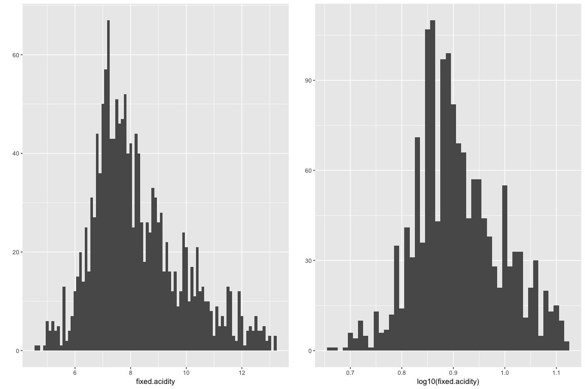<!-- -->

```
##      nbr.val     nbr.null       nbr.na          min          max 
## 1.534000e+03 0.000000e+00 0.000000e+00 4.600000e+00 1.320000e+01 
##        range          sum       median         mean      SE.mean 
## 8.600000e+00 1.266870e+04 7.900000e+00 8.258605e+00 4.167883e-02 
## CI.mean.0.95          var      std.dev     coef.var 
## 8.175356e-02 2.664750e+00 1.632406e+00 1.976612e-01
```

```
##      nbr.val     nbr.null       nbr.na          min          max 
## 1.534000e+03 0.000000e+00 0.000000e+00 6.627578e-01 1.120574e+00 
##        range          sum       median         mean      SE.mean 
## 4.578161e-01 1.394122e+03 8.976271e-01 9.088150e-01 2.124008e-03 
## CI.mean.0.95          var      std.dev     coef.var 
## 4.166269e-03 6.920504e-03 8.318956e-02 9.153630e-02
```

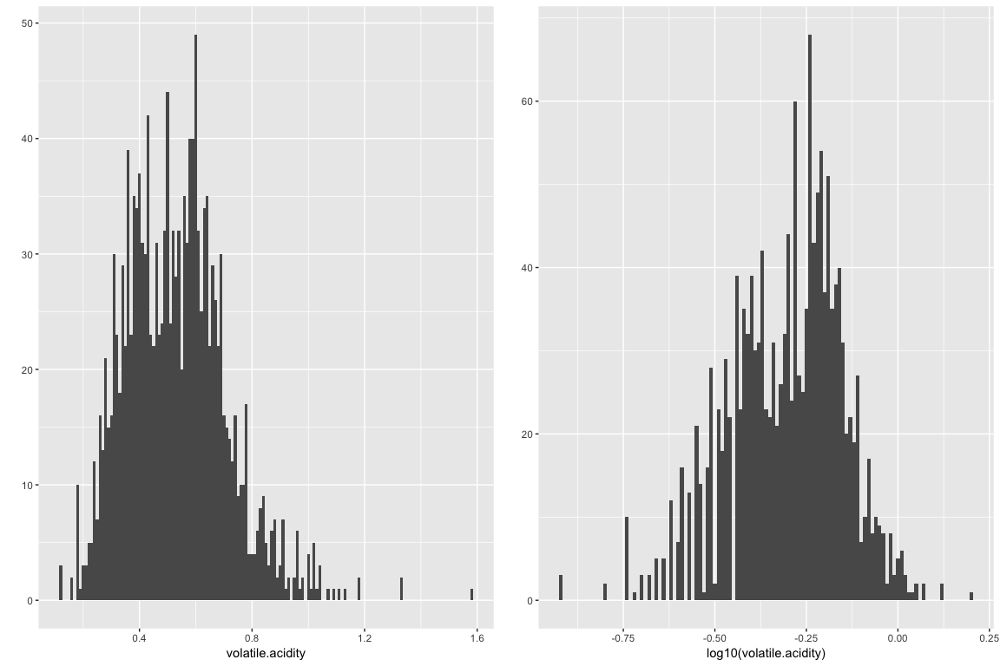<!-- -->

```
##      nbr.val     nbr.null       nbr.na          min          max 
## 1.534000e+03 0.000000e+00 0.000000e+00 1.200000e-01 1.580000e+00 
##        range          sum       median         mean      SE.mean 
## 1.460000e+00 8.111800e+02 5.200000e-01 5.288005e-01 4.533375e-03 
## CI.mean.0.95          var      std.dev     coef.var 
## 8.892273e-03 3.152599e-02 1.775556e-01 3.357705e-01
```

```
##       nbr.val      nbr.null        nbr.na           min           max 
##  1.534000e+03  3.000000e+00  0.000000e+00 -9.208188e-01  1.986571e-01 
##         range           sum        median          mean       SE.mean 
##  1.119476e+00 -4.633255e+02 -2.839967e-01 -3.020375e-01  3.882498e-03 
##  CI.mean.0.95           var       std.dev      coef.var 
##  7.615568e-03  2.312319e-02  1.520631e-01 -5.034577e-01
```

Citric acid appeared to have 128 values that were zero. It is unapparent whether these are rounding errors or input errors in the data. To check whether it affects our quality variable, we remove every row in the dataset where citric.acid is zero and store it in a temp variable. Comparing the two data sets, the distribution is relatively unaffected so it isn't too concerning.


```
##    Min. 1st Qu.  Median    Mean 3rd Qu.    Max. 
##   4.600   7.100   7.900   8.259   9.100  13.200
```
in the fixed acidity the minimum is 4.600 and maxmum is 13.200 and mean is 8.259


```
##    Min. 1st Qu.  Median    Mean 3rd Qu.    Max. 
##  0.6628  0.8513  0.8976  0.9088  0.9590  1.1206
```
in the log10 fixed acidity the minimum is 0.6628 and maxmum is 1.1206 and mean is 0.9088


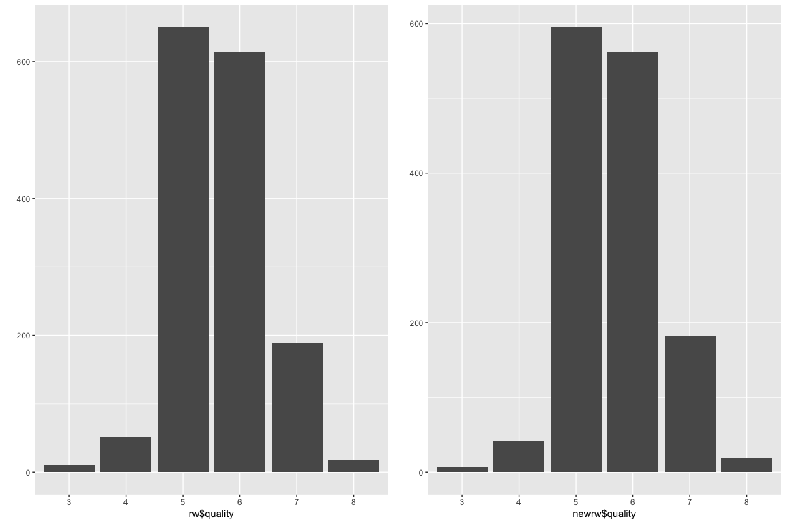<!-- -->

It appears that we can actually group wine quality into three distinct categories: bad, average, and excellent. Most of the red wines were average, followed by excellent, and then bad. It seems like the red wines overall were very average, with a few having excellent tastes. I'm interested in what makes a wine excellent or bad -- not what makes it average.


```
##       bad   average excellent 
##        62      1264       208
```

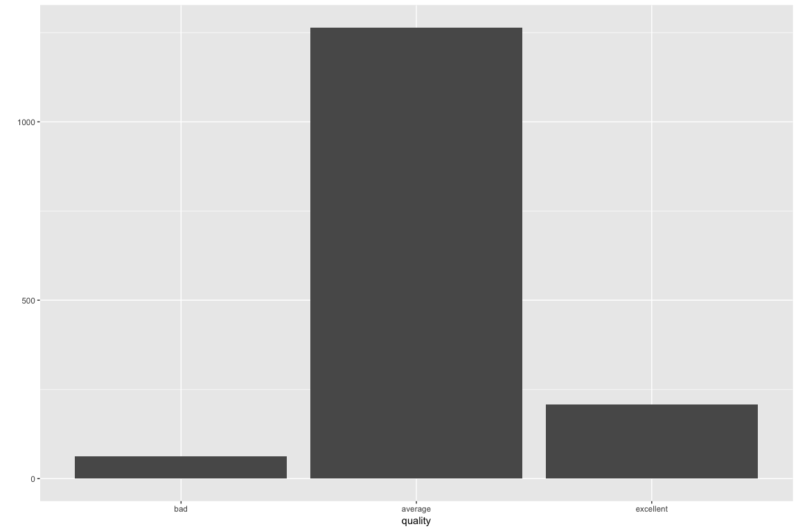<!-- -->


# Univariate Analysis

### What is the structure of your dataset?
There are 1534 observations after slicing out the top 1% from the variables that had large outliers (Fixed acidity, residual sugar, total sulfur dioxide, and free sulfur dioxide)

### What is/are the main feature(s) of interest in your dataset?
Quality is the main feature.  I want to determine what makes a wine taste good or bad.
### What other features in the dataset do you think will help support your investigation into your feature(s) of interest?

I suspect residual sugar, pH (and in a sense each type of acidity), density and alcohol content will play a key role in quality.

### Did you create any new variables from existing variables in the dataset?
Yes, I created a rating variable which is a subset of quality based on three distinct categories: (bad: 4,5), (average: 5,6), (excellent: 7,8)

### Of the features you investigated, were there any unusual distributions? Did you perform any operations on the data to tidy, adjust, or change the form of the data? If so, why did you do this?
* The top 1% of values were stripped off of fixed acidity, residual sugar, total sulfur dioxide, and free sulfur dioxide.
* The x column was removed as it was simply an index value of unimportance.
* Sulphates, fixed acidity, and total/free sulfur dioxide all appeared to be long tailed and were log-transformed which revealed a normal distribution for each.

# Bivariate Plots Section

To begin, I used ggpairs to get a better look at correlations between two variables.
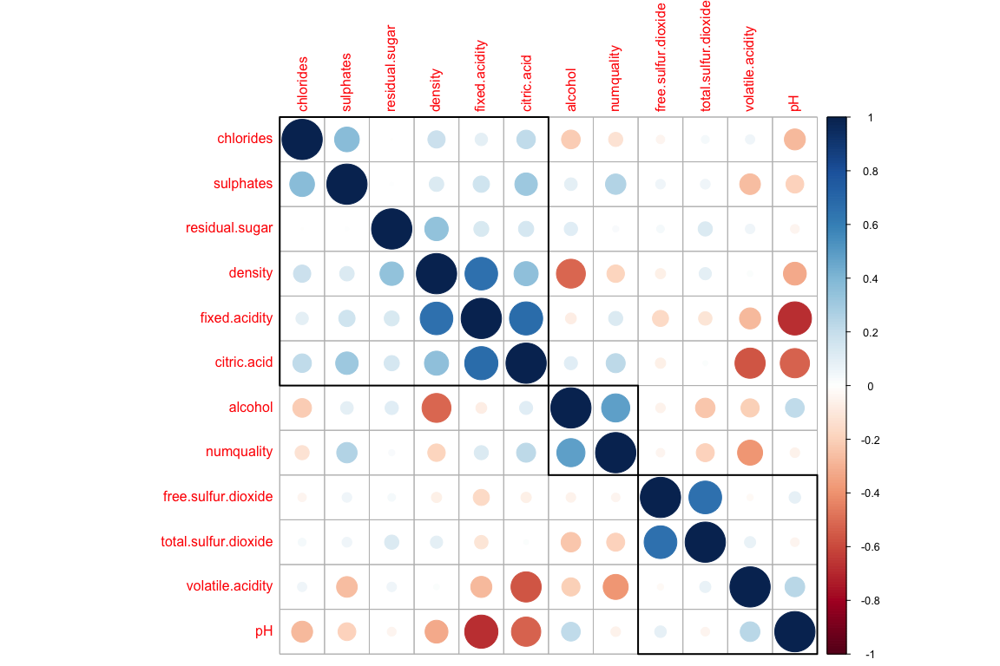<!-- -->

To see if the data makes sense chemically, I first plot pH and fixed acidity. The correlation coefficient is -0.67, meaning that pH tends to drop at fixed acidity increases, which makes sense.

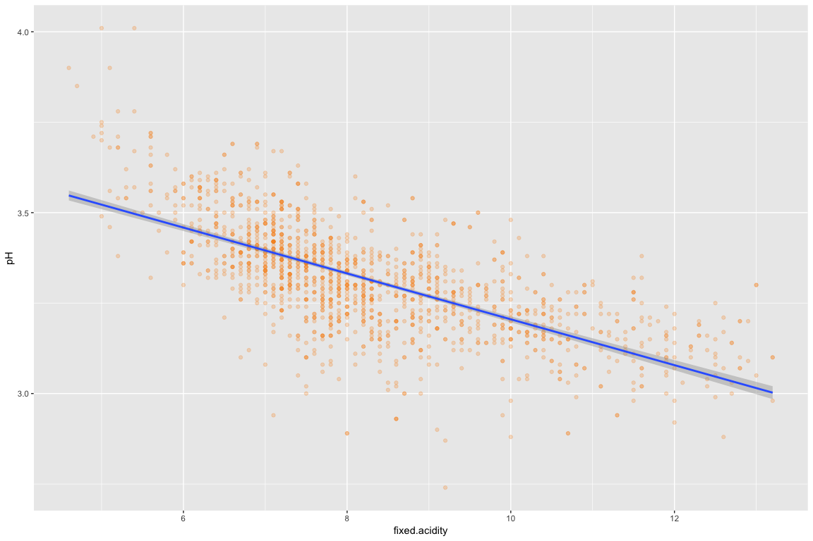<!-- -->

```
## [1] -0.6794406
```

The correlation between citric acid and pH is slightly weaker, being -0.52. This adds up as citric acid is a subset of fixed acidity.

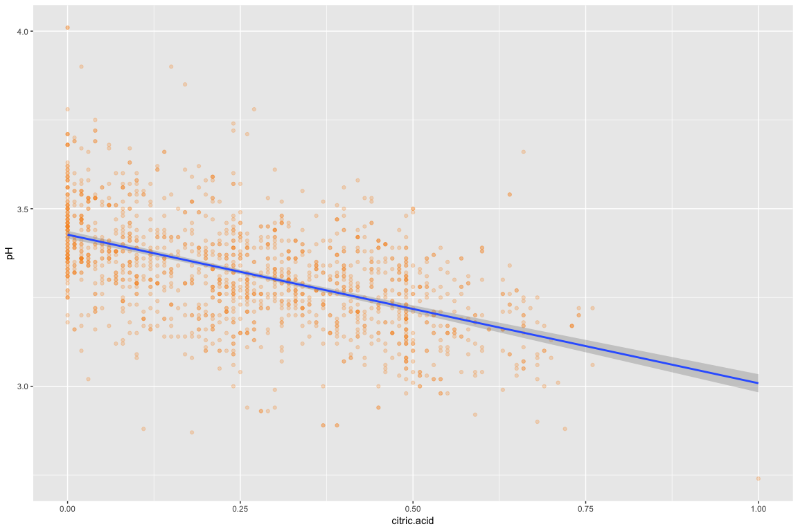<!-- -->

```
## [1] -0.5283267
```


Volatile acidity (acetic acid) seems to increase when pH level increases. The correlation coefficient was 0.23 indicating some positive correlation. Doing some digging online, I found that volatile acidity actually refers to the gaseous acidity. Therefore, if the wine is losing acid in the form of gas, it makes sense that the pH level rises, and therefore becomes less acidic.

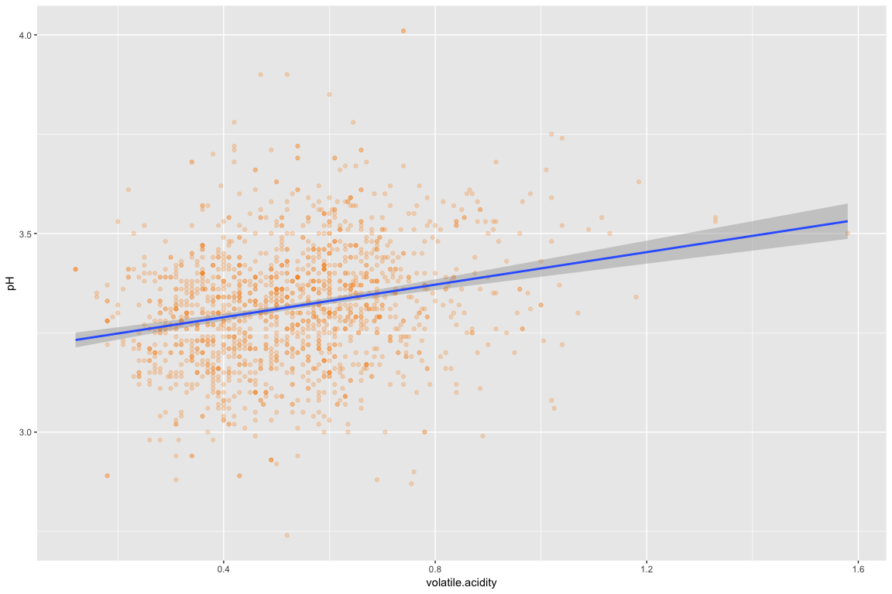<!-- -->

```
## [1] 0.2387919
```

I want to further explore alcohol, pH, volatile acidity, citric acid, and sulphates and see how they relate to the quality of the wine as they all had correlation coefficients greater than 0.2. Box plots are used and we use the median as a better measure for the variance in our data. As predicted, the median also follows suit with the correlation coefficients. The boxplots provide an extremely interesting fact about alcohol -- alcohol content is significantly higher for excellent wines compared to bad or average wines. Sulphates and citric acid also seem to be positively correlated to to quality, and volatile acidity appear to be negatively correlated.

<!-- -->

```
## rw$rating: bad
##    Min. 1st Qu.  Median    Mean 3rd Qu.    Max. 
##   2.740   3.303   3.380   3.385   3.500   3.900 
## -------------------------------------------------------- 
## rw$rating: average
##    Min. 1st Qu.  Median    Mean 3rd Qu.    Max. 
##   2.870   3.210   3.310   3.315   3.402   4.010 
## -------------------------------------------------------- 
## rw$rating: excellent
##    Min. 1st Qu.  Median    Mean 3rd Qu.    Max. 
##   2.880   3.200   3.280   3.295   3.380   3.780
```

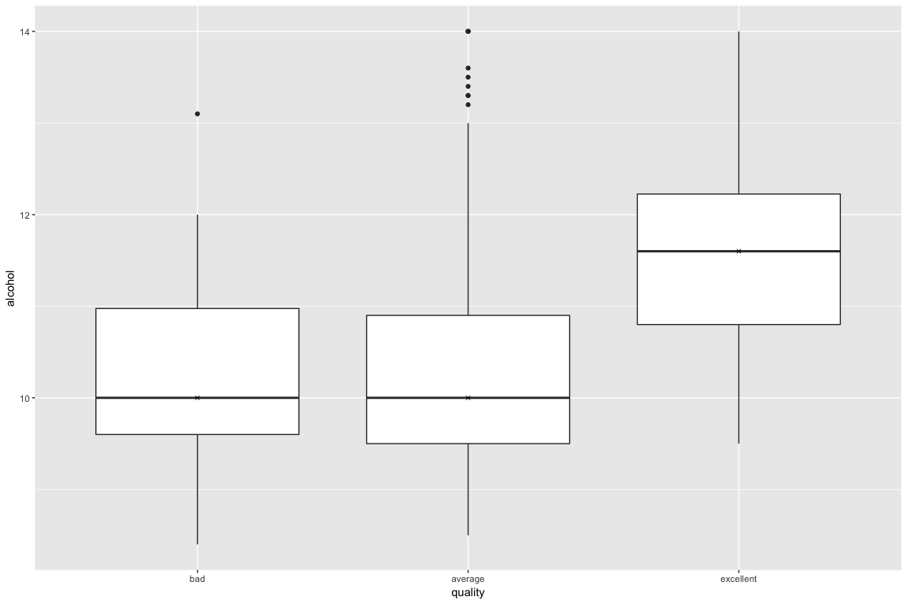<!-- -->

```
## rw$rating: bad
##    Min. 1st Qu.  Median    Mean 3rd Qu.    Max. 
##    8.40    9.60   10.00   10.20   10.97   13.10 
## -------------------------------------------------------- 
## rw$rating: average
##    Min. 1st Qu.  Median    Mean 3rd Qu.    Max. 
##    8.50    9.50   10.00   10.26   10.90   14.00 
## -------------------------------------------------------- 
## rw$rating: excellent
##    Min. 1st Qu.  Median    Mean 3rd Qu.    Max. 
##    9.50   10.80   11.60   11.54   12.22   14.00
```

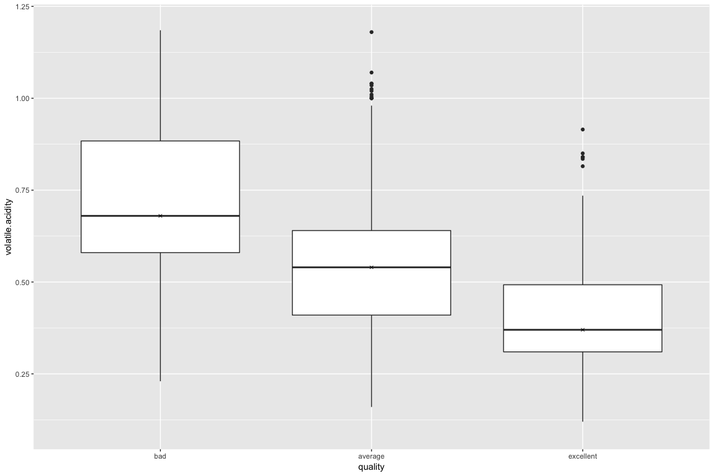<!-- -->

```
## rw$rating: bad
##    Min. 1st Qu.  Median    Mean 3rd Qu.    Max. 
##  0.2300  0.5800  0.6800  0.7306  0.8838  1.5800 
## -------------------------------------------------------- 
## rw$rating: average
##    Min. 1st Qu.  Median    Mean 3rd Qu.    Max. 
##  0.1600  0.4100  0.5400  0.5386  0.6400  1.3300 
## -------------------------------------------------------- 
## rw$rating: excellent
##    Min. 1st Qu.  Median    Mean 3rd Qu.    Max. 
##  0.1200  0.3100  0.3700  0.4090  0.4925  0.9150
```

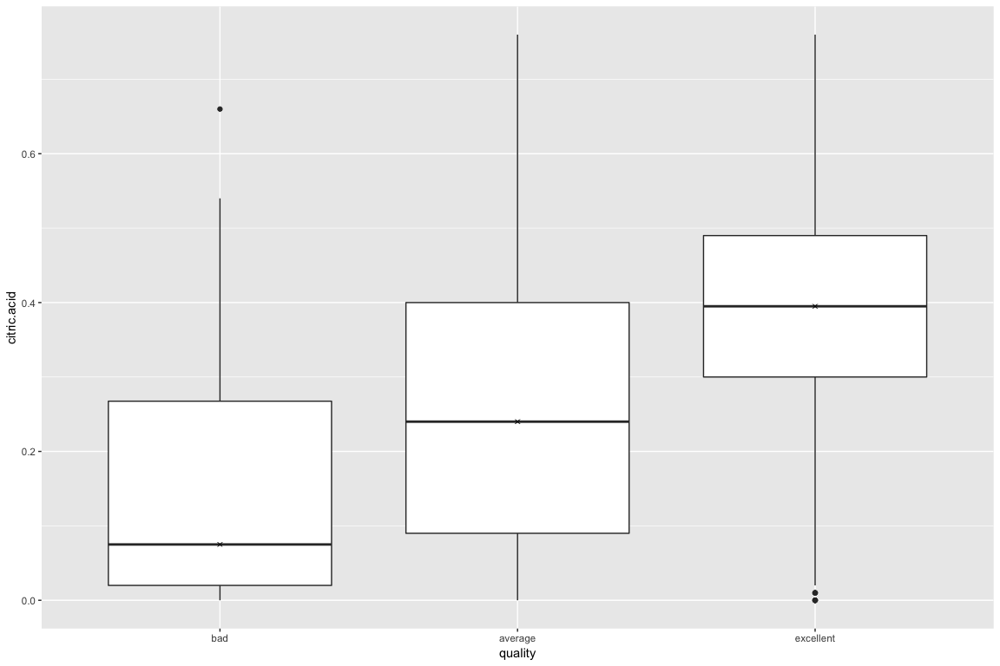<!-- -->

```
## rw$rating: bad
##    Min. 1st Qu.  Median    Mean 3rd Qu.    Max. 
##  0.0000  0.0200  0.0750  0.1713  0.2675  1.0000 
## -------------------------------------------------------- 
## rw$rating: average
##    Min. 1st Qu.  Median    Mean 3rd Qu.    Max. 
##  0.0000  0.0900  0.2400  0.2538  0.4000  0.7600 
## -------------------------------------------------------- 
## rw$rating: excellent
##    Min. 1st Qu.  Median    Mean 3rd Qu.    Max. 
##  0.0000  0.3000  0.3950  0.3687  0.4900  0.7600
```

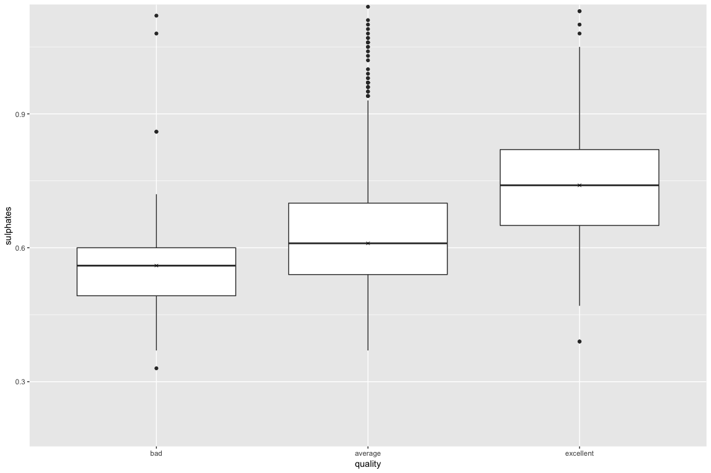<!-- -->

```
## rw$rating: bad
##    Min. 1st Qu.  Median    Mean 3rd Qu.    Max. 
##  0.3300  0.4925  0.5600  0.5927  0.6000  2.0000 
## -------------------------------------------------------- 
## rw$rating: average
##    Min. 1st Qu.  Median    Mean 3rd Qu.    Max. 
##  0.3700  0.5400  0.6100  0.6457  0.7000  1.9800 
## -------------------------------------------------------- 
## rw$rating: excellent
##    Min. 1st Qu.  Median    Mean 3rd Qu.    Max. 
##  0.3900  0.6500  0.7400  0.7444  0.8200  1.3600
```

Based on the scatterplox matrix shown earlier, we notice some interesting relationships between the following variables:
* Citric Acid and pH (-0.528)
* Citric Acid and Volatile Acidity (-0.563)
* Citric Acid and Sulphates (0.312)

However, none of the variables share much in common with alcohol - the highest is pH, which had a correlation coefficient of 0.217. However, alcohol and quality have a 0.488 correlation coefficient, which may be leading me somewhere.

It appears that when citric acid is in higher amounts, sulphates are as well. The freshness from the citric acid and the antimicrobial effects of the sulphates are likely correlated. The correlation coefficient was 0.33 which indicates weak correlation, but still noteworthy.

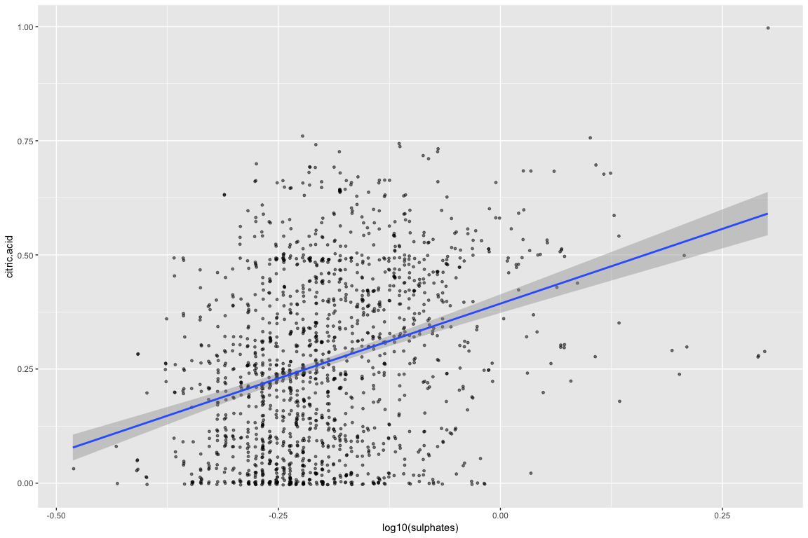<!-- -->

```
## [1] 0.3302825
```

When graphing volatile acidity and citric acid, there is clearly a negative correlation between the two. It seems that fresher wines tend to avoid the use of acetic acid. The correlation coefficient was -0.56, indicating that larger amounts of citric acid meant smaller amounts of volatile acidity. Since volatile acidity is essentially acetic acid, the wine makers would likely not put a large amount of two acids in the wine, leading them to choose one or the other.

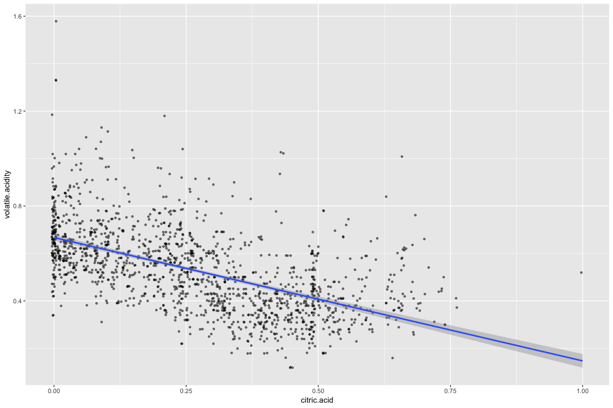<!-- -->

```
## [1] -0.5629224
```

There is no particularly striking relationship between alcohol and pH -- a weak positive correlation of 0.21.

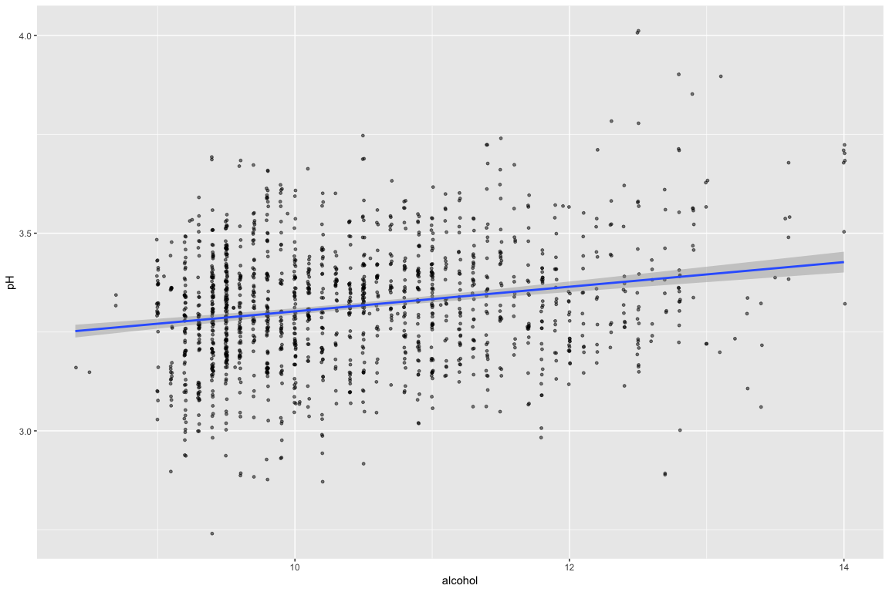<!-- -->

```
## [1] 0.2166557
```

# Bivariate Analysis

### Talk about some of the relationships you observed in this part of the investigation. How did the feature(s) of interest vary with other features in the dataset?

It appears that when citric acid is in higher amounts, sulphates are as well. The freshness from the citric acid and the antimicrobial effects of the sulphates are likely correlated. Volatile acidity and citric acid are negatively correlated. It is likely that fresher wines avoid the bitter taste of acetic acid. Citric acid and pH were also negatively correlated -- a lower pH indicates a higher acidity. pH and alcohol are very weakly correlated. Pure alcohol (100%) has a pH of 7.33, so when it is diluted it will likely increase the pH level ever so slightly.

The boxplots reveal an interesting picture as well:

* The median for sulphates increased for each quality type. The biggest jump was from average to excellent, with a median of aproximately 0.74 for excellent and 0.61 for average.
* Citric acid had the highest concentration for excellent wines. The median jumped evenly throughout the different quality categories. With medians of 0.075 for bad, 0.24 for average, and 0.395 for excellent.
* As volatile acidity increased, the median for the wine became worse, with medians of 0.68 for bad, 0.54 for average, and 0.37 for excellent. It's possible that past a certain threshold, the acetic acid vecame too bitter for the tasters.
* The median for alcohol content (10%) was the same the wine was bad or average. However, for the excellent wines, the alcohol content was 11.6%. This leads to a striking observation: a higher alcohol content may make a wine excellent from average, however there are other factors at play that make a wine taste bad.
* pH didn't change significantly much between the wines, with medians of 3.38 for bad, 3.31 for average, and 3.280 for excellent.

### Did you observe any interesting relationships between the other features (not the main feature(s) of interest)?
Volatile acidity and citric acid were negatively correlated, as were citric acid and pH. Fixed acidity and pH were negatively correlated, due to the lower pH/more acidic effect.

### What was the strongest relationship you found?
From the variables analyzed, the strongest relationship was between Citric Acid and Volatile Acidity, which had a correlation coefficient of -0.563.

# Multivariate Plots Section

When comparing sulphates to alcohol, I noticed that for average wines, quality increased typically as sulphates increased. For bad wines, there didn't seem to be any important relationship between the two variables, other than lower alcohol content and lower sulphate content. For excellent wines, it appeared that alcohol played a larger role in determining quality given a specific sulphate level.

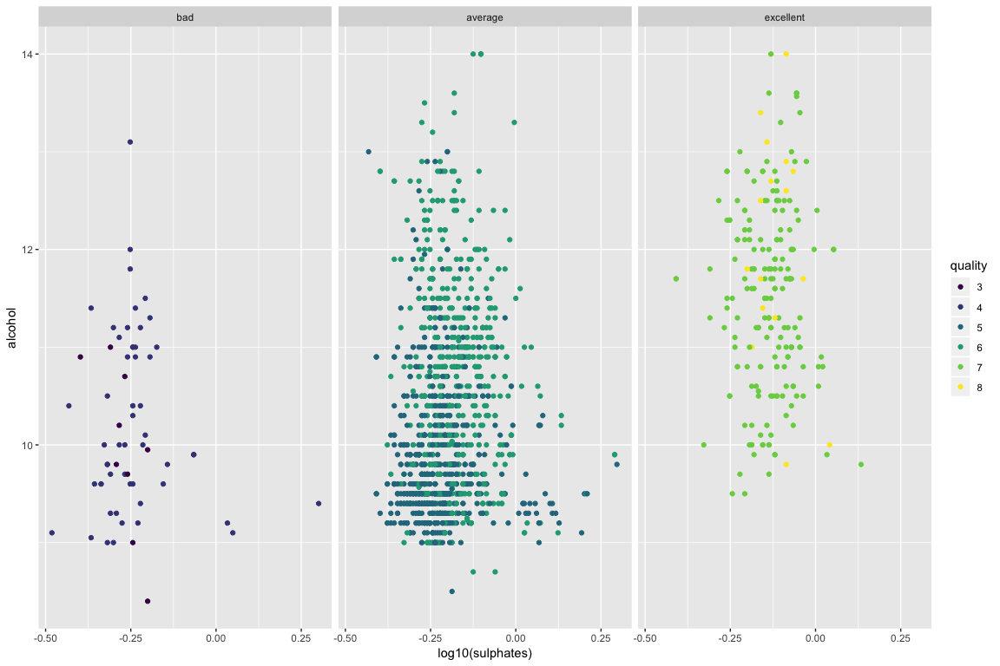<!-- -->

I know that citric acid affects quality as well, and I wanted to see how exactly. Citric acid content had a large cluster of excellent wines when the contents was greater than 0.25 g/dm^3. It appeared that at a given level of citric acid, higher alcohol content typically meant greater wines, with the exception of bad wines. It's likely that these bad wines had a different factor that was overpowering the benefits of the added alcohol.

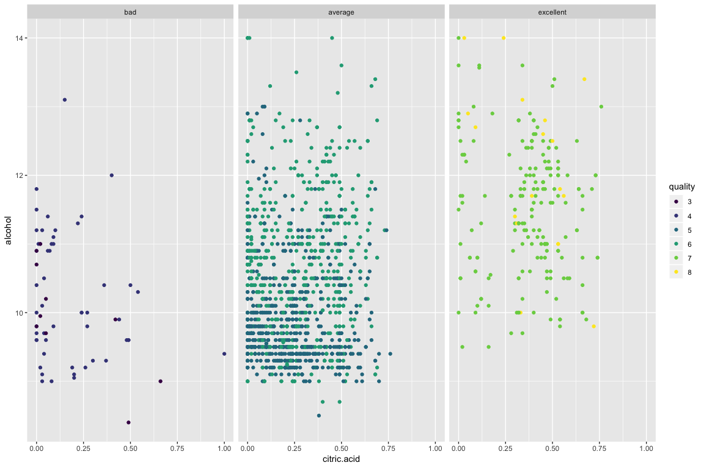<!-- -->

I wanted to get a feel for how sulphates compared to citric acid. For bad wines, most wines had low citric acid and sulphate content. For average wines, a larger sulphates level clearly determined better quality. Excellent wines tended to have sulphates with a content between -0.25 and 0.00, but higher concentrations of citric acid (mainly between 0.3 and 0.55) had the largest cluster. The median for bad wine was -0.2518 and for average wines -0.2147. It would seem that low sulphates is definitely largely responsible to bad wines. However, there are a lot of average wines with the same sulphates content, meaning there is certainly another variable at play.


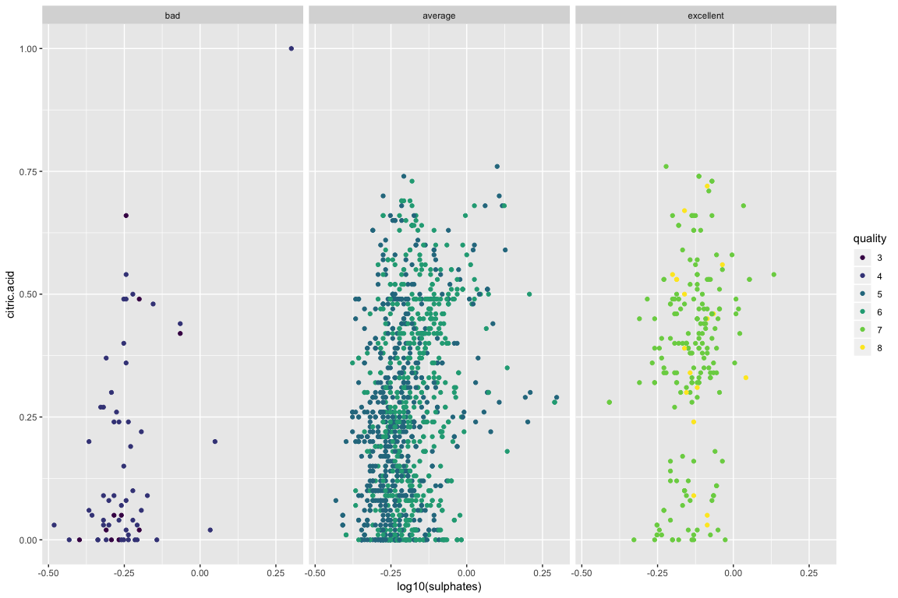<!-- -->

```
## rw$rating: bad
##    Min. 1st Qu.  Median    Mean 3rd Qu.    Max. 
## -0.4815 -0.3076 -0.2518 -0.2455 -0.2218  0.3010 
## -------------------------------------------------------- 
## rw$rating: average
##    Min. 1st Qu.  Median    Mean 3rd Qu.    Max. 
## -0.4318 -0.2676 -0.2147 -0.2014 -0.1549  0.2967 
## -------------------------------------------------------- 
## rw$rating: excellent
##     Min.  1st Qu.   Median     Mean  3rd Qu.     Max. 
## -0.40894 -0.18709 -0.13077 -0.13514 -0.08619  0.13354
```

From the data analyzed, I suspect there is another variable that is responsible for bad wines other than sulphates. To try to be as accurate as possible, I'd like to graph of a few of my suspects, which may lead to dead ends. I will test out chlorides, residual sugar, and volatile acidity. I avoided fixed acidity since I am going to be comparing these variables to citric acid, which is essentially a large subset of fixed acidity. I'm avoiding testing pH levels because the data earlier indicated that pH was not significantly different with regards to wine quality. Rather, it is more likely to be the composition of the acids.

Since lower citric acids were found in bad, average, and excellent wines, I want to use it as the test subject to make further inferences.

For a given level of chlorides, while there is a large cluster of citric acids being 0, there are many average wines and a few excellent wines that also have the same citric acid value. Additionally, most wines have similar levels of chlorides. Therefore, I feel continuing to explore chlorides is a dead end.  

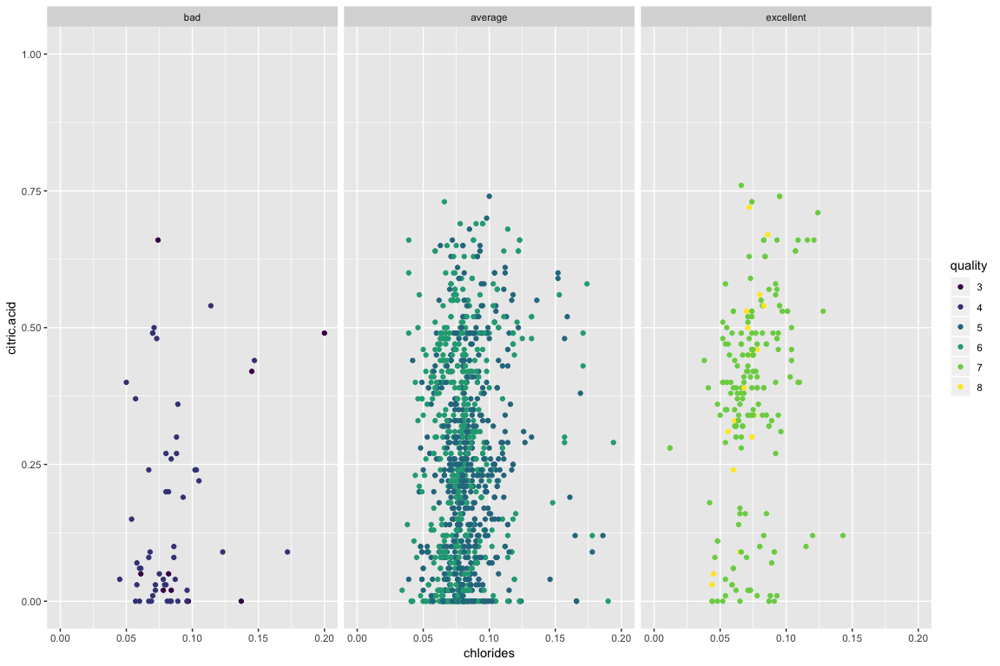<!-- -->

```
## rw$rating: bad
##    Min. 1st Qu.  Median    Mean 3rd Qu.    Max. 
## 0.04500 0.06925 0.08050 0.09640 0.09525 0.61000 
## -------------------------------------------------------- 
## rw$rating: average
##    Min. 1st Qu.  Median    Mean 3rd Qu.    Max. 
## 0.03400 0.07100 0.08000 0.08833 0.09000 0.61100 
## -------------------------------------------------------- 
## rw$rating: excellent
##    Min. 1st Qu.  Median    Mean 3rd Qu.    Max. 
## 0.01200 0.06200 0.07300 0.07602 0.08525 0.35800
```

Similar to chlorides, there is nothing too striking about residual sugar content causing bad wines.

```
##    Min. 1st Qu.  Median    Mean 3rd Qu.    Max. 
## 0.01200 0.07000 0.07900 0.08699 0.09000 0.61100
```

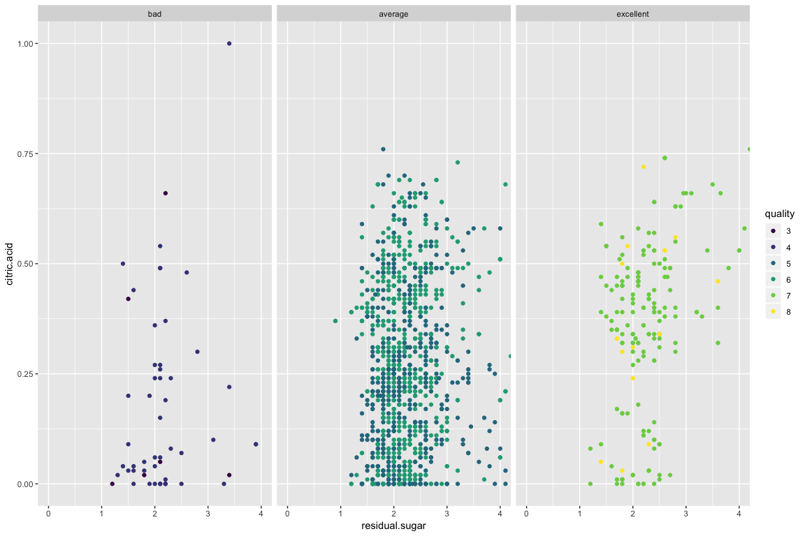<!-- -->

```
## rw$rating: bad
##    Min. 1st Qu.  Median    Mean 3rd Qu.    Max. 
##    1.20    1.90    2.10    2.52    2.75    6.30 
## -------------------------------------------------------- 
## rw$rating: average
##    Min. 1st Qu.  Median    Mean 3rd Qu.    Max. 
##   0.900   1.900   2.200   2.368   2.500   8.300 
## -------------------------------------------------------- 
## rw$rating: excellent
##    Min. 1st Qu.  Median    Mean 3rd Qu.    Max. 
##   1.200   1.975   2.300   2.625   2.663   6.700
```

This graph is interesting - most bad wines seem to have higher levels of volatile acidity, and most excellent wines also had lower levels of volatility. To get an idea behind the numbers -- the median volatile acidity was 0.68 for excellent wines and 0.37 for bad wines -- a noticeable decrease.

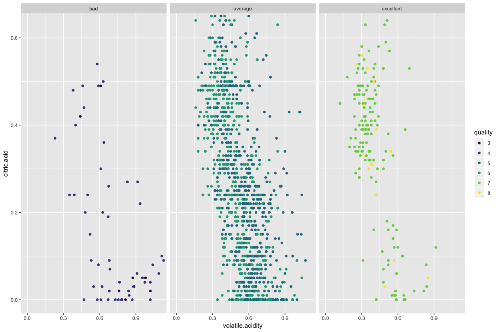<!-- -->

```
## rw$rating: bad
##    Min. 1st Qu.  Median    Mean 3rd Qu.    Max. 
##  0.2300  0.5800  0.6800  0.7306  0.8838  1.5800 
## -------------------------------------------------------- 
## rw$rating: average
##    Min. 1st Qu.  Median    Mean 3rd Qu.    Max. 
##  0.1600  0.4100  0.5400  0.5386  0.6400  1.3300 
## -------------------------------------------------------- 
## rw$rating: excellent
##    Min. 1st Qu.  Median    Mean 3rd Qu.    Max. 
##  0.1200  0.3100  0.3700  0.4090  0.4925  0.9150
```

As mentioned above, the median volatile acidity was 0.68 for bad wines, 0.54 for average wines, and 0.37 for excellent wines. For the upper right cluster under bad wines, we see that the higher alcoholic content of the wines cannot offset the high volatile acidity -- that being greater than 0.8 g / dm^3. 

<!-- -->

Comparing volatile acidity with sulphates, it's become clear that excellent wines have a lower volatile acidity and a higher sulphates content and bad wines have a lower sulphates content and higher volatile acidity content.

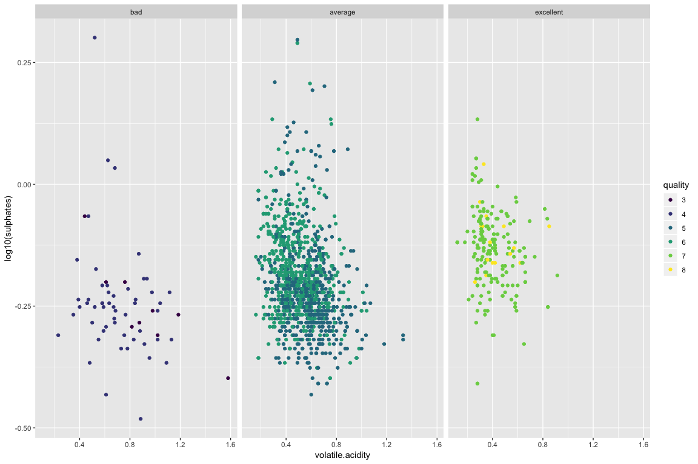<!-- -->

```
## rw$rating: bad
##    Min. 1st Qu.  Median    Mean 3rd Qu.    Max. 
##  0.2300  0.5800  0.6800  0.7306  0.8838  1.5800 
## -------------------------------------------------------- 
## rw$rating: average
##    Min. 1st Qu.  Median    Mean 3rd Qu.    Max. 
##  0.1600  0.4100  0.5400  0.5386  0.6400  1.3300 
## -------------------------------------------------------- 
## rw$rating: excellent
##    Min. 1st Qu.  Median    Mean 3rd Qu.    Max. 
##  0.1200  0.3100  0.3700  0.4090  0.4925  0.9150
```

## Linear Model

Below are data values related to a linear model created from four major variables: alcohol, sulphates, citric acid, and volatile acidity. These were all compared to quality and the below graph displays the average residual, or error, of the predictions for each quality.


```
## 
## Calls:
## m1: lm(formula = as.numeric(quality) ~ alcohol, data = rw)
## m2: lm(formula = as.numeric(quality) ~ alcohol + sulphates, data = rw)
## m3: lm(formula = as.numeric(quality) ~ alcohol + sulphates + citric.acid, 
##     data = rw)
## m4: lm(formula = as.numeric(quality) ~ alcohol + sulphates + citric.acid + 
##     volatile.acidity, data = rw)
## 
## ============================================================================
##                          m1            m2            m3            m4       
## ----------------------------------------------------------------------------
##   (Intercept)          -0.266        -0.757***     -0.704***      0.492*    
##                        (0.179)       (0.181)       (0.180)       (0.207)    
##   alcohol               0.374***      0.358***      0.351***      0.322***  
##                        (0.017)       (0.017)       (0.017)       (0.016)    
##   sulphates                           1.000***      0.824***      0.711***  
##                                      (0.104)       (0.108)       (0.105)    
##   citric.acid                                       0.511***     -0.087     
##                                                    (0.096)       (0.108)    
##   volatile.acidity                                               -1.242***  
##                                                                  (0.117)    
## ----------------------------------------------------------------------------
##   R-squared             0.239         0.282         0.295         0.344     
##   adj. R-squared        0.238         0.281         0.294         0.342     
##   sigma                 0.707         0.687         0.681         0.657     
##   F                   479.886       300.740       213.633       200.172     
##   p                     0.000         0.000         0.000         0.000     
##   Log-likelihood    -1644.831     -1599.682     -1585.485     -1530.839     
##   Deviance            766.824       722.987       709.728       660.922     
##   AIC                3295.663      3207.363      3180.970      3073.678     
##   BIC                3311.670      3228.706      3207.648      3105.692     
##   N                  1534          1534          1534          1534         
## ============================================================================
```

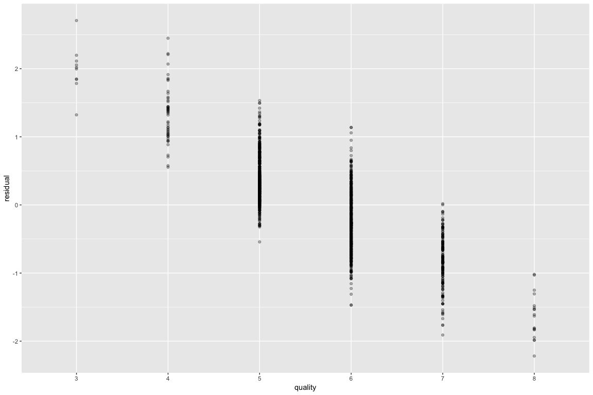<!-- -->

# Multivariate Analysis

### Talk about some of the relationships you observed in this part of the investigation. Were there features that strengthened each other in terms of looking at your feature(s) of interest?

Based on the multivariate analysis, five features stood out to me: alcohol, sulphates, citric acid, volatile acidity, and quality. Throughout my analysis, chlorides and residual sugar lead to dead ends. However, high volatile acidity and low sulphates were a strong indicator of the presence of bad wine. High alcohol content, low volatile acidity, higher citric acid, and lower sulphates all made for a good wine.

The relationships are reiterated as follows:

* It appeared that having a low sulphate count gave the alcohol a bad quality. However, when sulphates were between 0 and 0.25, the quality improved as the alcohol content improved.

* Sulphates versus citric acid revealed that for average wines, sulphates were generally larger. However, for excellent wines, at a given level of sulphates, a higher citric acid content led to an excellent wine. As such, this leads me to believe that citric acid was more important than sulphates with regards to what made a wine excellent. However, a sulphate content between -0.25 and 0 (log10) was necessary in order for a wine to be sufficient. Therefore, this strengthens the notion that low sulphate quality played a key role in average or bad wines.

* Citric acid and Alcohol: There is certainly a relationship between alcohol content and citric acid. Lower quality wines tended to be lower in alcohol content and citric acid. Alcohol content made average wines taste better regardless of citric acid content. Excellent wines tended to be higher in alcohol content and citric acid. This leads me to believe that alcohol content plays a key role in making a wine excellent.

* The relationship between volatile acidity and alcohol is striking: a low volatile acidity rating appeared to be a requirement in order for a wine to be excellent. There is a large cluster of average wines when volatile acidity is between 0.4 and 0.8 and alcohol content is between 9 and 10%, whereas most excellent wines had majority of their volatility between 0.1 and 0.4. Bad or average wines were generally over 0.4 volatile acidity, regardless of alcoholic content.

This analysis leads me to believe bad wines generally have low sulphate content and higher volatile acidity. Excellent wines appear to have low volatile acidity, higher citric acid, higher sulphates, and higher alcohol content. However, higher alcohol content might have the final say in making a wine excellent.

### OPTIONAL: Did you create any models with your dataset? Discuss the strengths and limitations of your model.

Yes, I created a linear model using four of the variables I felt were important: alcohol, citric acid, sulphates, and volatile acidity. The model was lackluster in predicting qualities of 3, 4, 7, and 8, where the error was +/- 2. For qualities of 5 and 6, the majority of predictions were off by 0.5 and 1 for each bound. The limitations of this model are obvious -- I'm trying to use a linear model for data that obviously isn't perfectly linear. Researching and using better classifiers would likely lead to a more accurate prediction, but this is out of the scope of the project.

------

# Final Plots and Summary

### Plot One: Alcohol and Quality
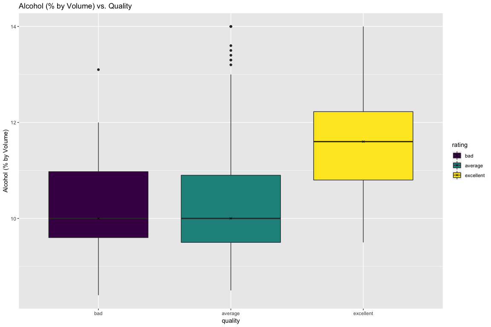<!-- -->

```
## rw$rating: bad
##    Min. 1st Qu.  Median    Mean 3rd Qu.    Max. 
##    8.40    9.60   10.00   10.20   10.97   13.10 
## -------------------------------------------------------- 
## rw$rating: average
##    Min. 1st Qu.  Median    Mean 3rd Qu.    Max. 
##    8.50    9.50   10.00   10.26   10.90   14.00 
## -------------------------------------------------------- 
## rw$rating: excellent
##    Min. 1st Qu.  Median    Mean 3rd Qu.    Max. 
##    9.50   10.80   11.60   11.54   12.22   14.00
```

### Description One

This graph was interesting because it showed how excellent wines tended to have a higher alcohol content all else equal. By this I mean certain precursors had to exist for alcohol to be the predominant determininant for quality. 

### Plot Two: Alcohol & Sulphates vs. Quality
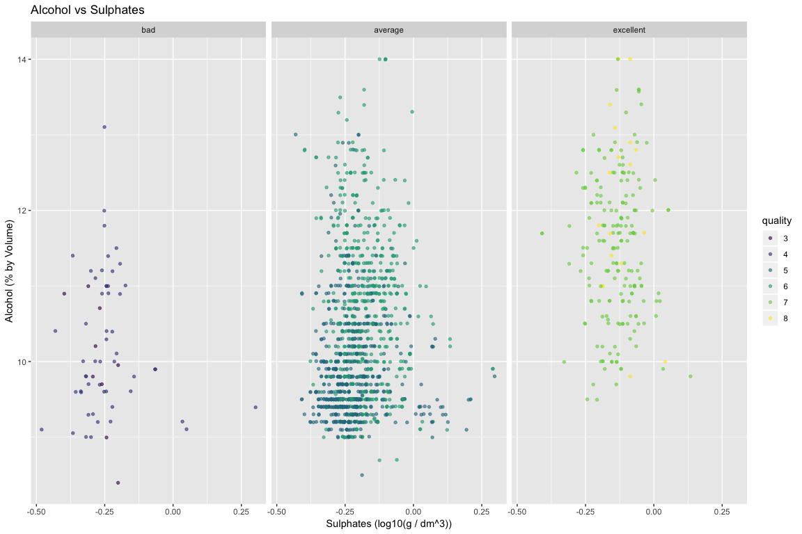<!-- -->


### Description Two

Observe that lower sulphates content typically leads to a bad wine with alcohol varying between 9% and 12%. Average wines have higher concentrations of sulphates, however wines that are rated 6 tend to have higher alcohol content and larger sulphates content. Excellent wines are mostly clustered around higher alcohol contents and higher sulphate contents. 

This graph makes it fairly clear that both sulphates and alcohol content contribute to quality. One thing I found fairly interested was that when sulphates were low, alcohol level still varied by 3%, but the wine was still rated bad. Low sulphate content appears to contribute to bad wines.

### Plot Three: Volatile Acidity vs Quality
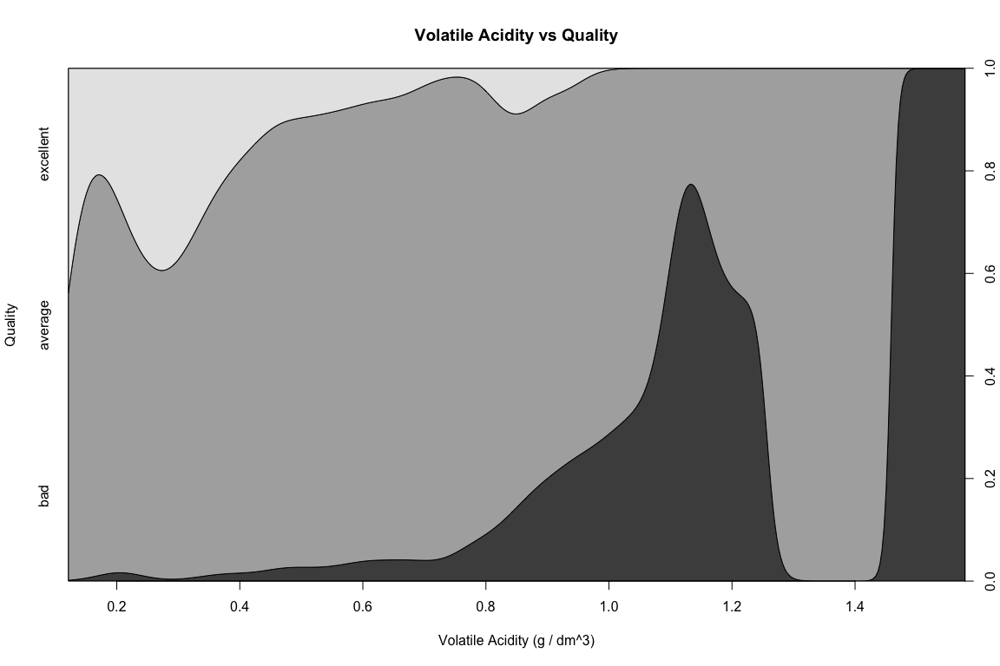<!-- -->

### Description Three

As we can see, when volatile acidity is greater than 1, the probability of the wine being excellent is zero. When volatile acidity is either 0 or 0.3, there is roughly a 40% probability that the wine is excellent. However, when volatile acidity is between 1 and 1.2 there is an 80% chance that the wine is bad. Moreover, any wine with a volatile acidity greater than 1.4 has a 100% chance of being bad. Therefore, volatile acidity is a good predictor for bad wines.

------

# Reflection

The red wine data set contains information on roughly 1,500 red wines created by the same company that differed chemically. Initially, I tried to get a sense of what factors might affect the quality of the wine. Due to a large number of different chemicals, I made assumptions that some variables were either subsets of each other or depended on each other; these turned out to be true. For example, pH was negatively correlated to volatile acidity, which makes sense. I created a linear model to attempt to predict red wine qualities, which was fairly accurate for average wines but extremely inaccurate for bad/excellent wines; it either over predicted bad wines and underpredicted the good ones. This is likely due to the fact that the wine data was not linear, and bad and excellent wines tended to rely on certain precursors (citric acid, sulphates, volatile acidity) being present in specific amounts. 

Alcohol content appeared to be the number one factor for determining an excellent wine. Citric acid and sulphates had to be in specific amounts in order for alcohol to take over, however. This is likely due to the fact that alcohol "packs a punch" so to speak -- it makes a great wine greater by adding some strength to it.

Conversely, Volatile acidity essentially made a wine bad in large amounts, regardless of the circumstances. This makes sense, as large amounts of acetic acid create a bitter taste.

Obvious weaknesses in this data are due to biases in the wine tasters' preferences. Since the wine tasters were experts, they tend to look for different things in wine than the average person. For example, many wine experts tend to have certain strategies on which they judge a wine (swish in mouth, dryness, etc). A normal person would likely not know about these methods and as such I'd like to see how normal people would also rate these wines. I'd be curious to see if the factors differ at all. Choosing different populations/levels of wine tasters would further strengthen similarities in the data.

## Struggles / Successes

For one thing, while 13 variables doesn't seem like much, it lead to a lot of dead ends which was very time consuming. It is important to mention that while dead ends can be time consuming and frustrating, they eventually lead to variables of interest, and help narrow down the exploration criteria significantly. I struggled with choosing the most appropriate graph for a given context. To overcome this, I wrote out a list of the different graphs at my disposal and determined the strengths/weaknesses of each. This made choosing different plots very easy.

